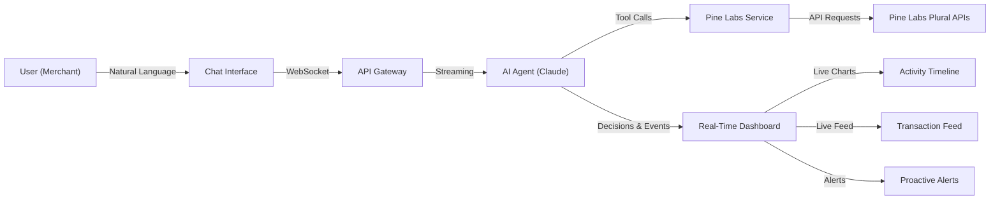
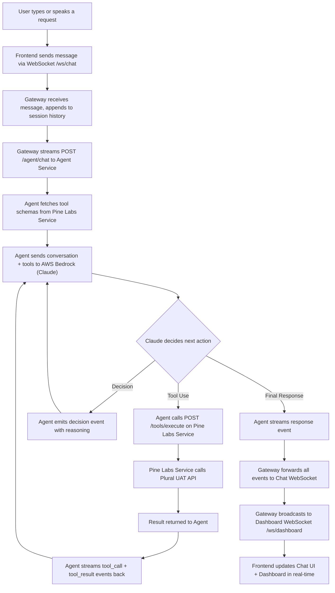
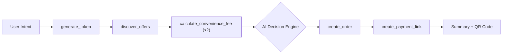
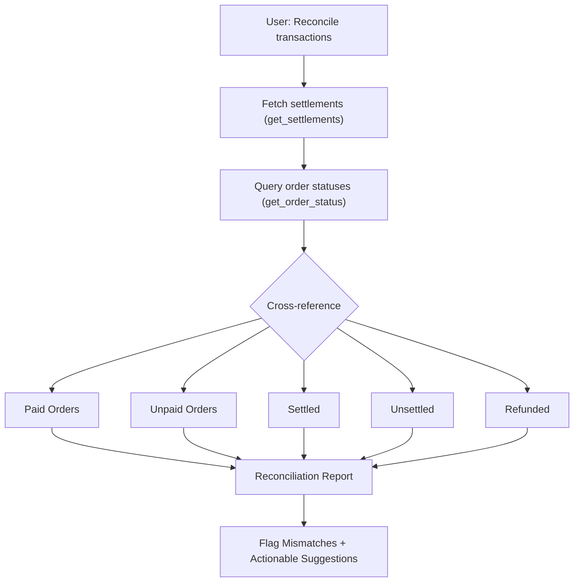
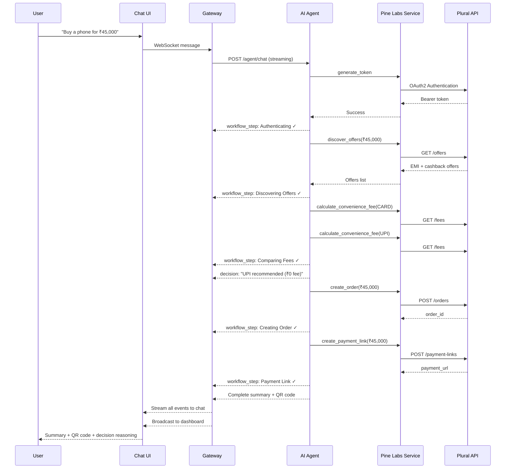
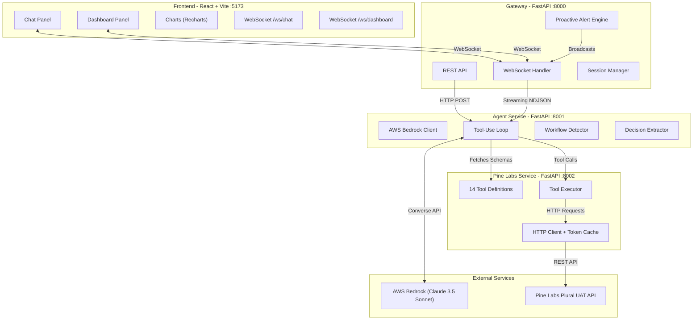
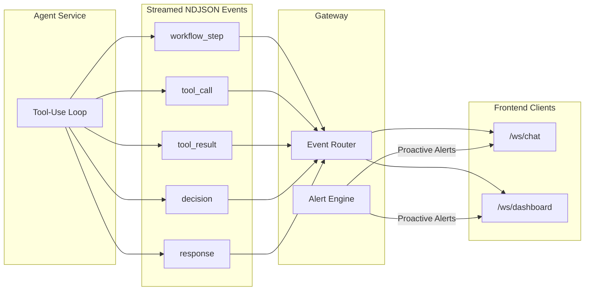
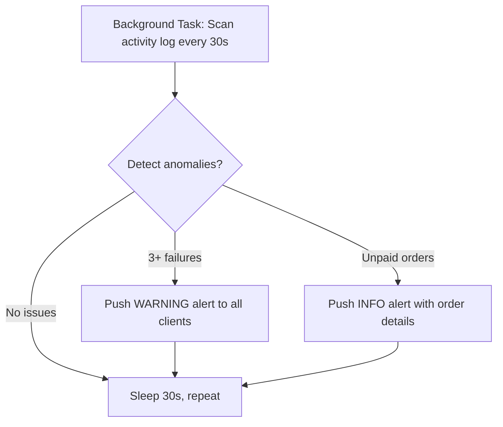
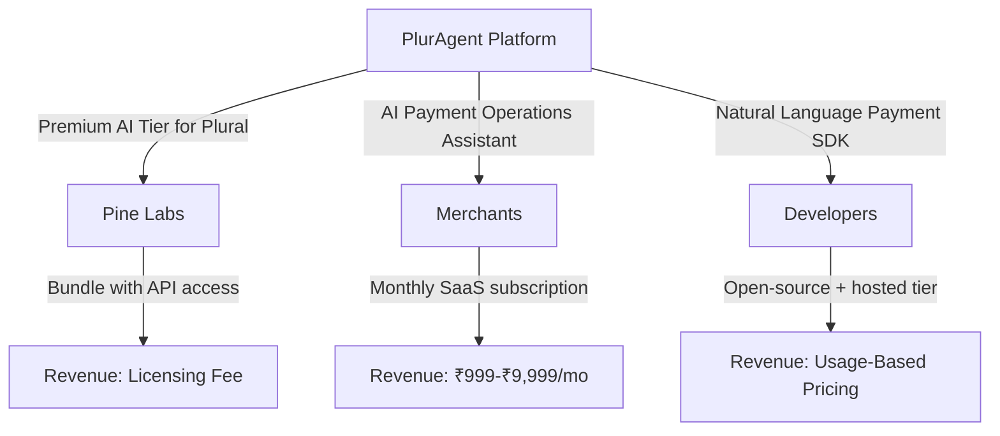
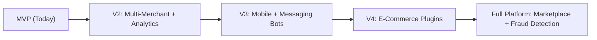

# PlurAgent

### Agentic Commerce & Intelligent Payments Platform

> *"From natural language to payment in seconds — AI that thinks, decides, and acts."*

**Pine Labs AI Hackathon 2026** | **Devanshu Dangi**

---

## Table of Contents

1. [Problem Statement](#1-problem-statement)
2. [Current Solutions & Limitations](#2-current-solutions--limitations)
3. [Our Solution — PlurAgent](#3-our-solution--pluragent)
4. [Innovation](#4-innovation)
5. [How It Works](#5-how-it-works)
6. [Technical Architecture](#6-technical-architecture)
7. [14 Pine Labs API Tools](#7-14-pine-labs-api-tools)
8. [Demo Scenarios](#8-demo-scenarios)
9. [Impact & Benefits](#9-impact--benefits)
10. [How to Sell — Business Model](#10-how-to-sell--business-model)
11. [Future Scope](#11-future-scope)
12. [Thank You & Q\&A](#12-thank-you--qa)

---

## 1. Problem Statement

### The Reality of Payment Integration Today

Every time a merchant wants to accept payments online, they face an invisible wall of complexity. What sounds simple — "take a payment" — actually requires **5–7 sequential API calls**, careful error handling, and manual decision-making at every step.

### Who Is Affected?

| Stakeholder | Pain Point |
|---|---|
| **Merchants** | Spend weeks integrating payment APIs, manually monitor failures, reconcile transactions in spreadsheets |
| **Developers** | Write hundreds of lines of boilerplate for each checkout flow, hardcode every business rule |
| **Payment Teams** | No real-time visibility into what's happening, discover failures hours later |
| **End Customers** | Experience abandoned checkouts when a single payment method fails with no automatic fallback |

### The Core Frictions

- **Manual orchestration** — Each checkout requires auth, order creation, offer discovery, fee comparison, payment execution, and settlement tracking — all coded by hand
- **Silent failures** — When a CARD payment is declined, the system gives up. No retry, no fallback to UPI, no notification
- **Zero intelligence** — Current integrations don't compare payment methods, don't recommend the cheapest option, don't learn from patterns
- **Blind reconciliation** — Merchants manually cross-reference orders, payments, and settlements to find mismatches — a process that takes hours
- **No proactive monitoring** — Issues like unpaid orders or repeated failures go unnoticed until someone manually checks

### Why It Matters

The Indian digital payments market processes **billions of transactions annually**. Even a 1% improvement in payment success rates, checkout speed, or operational efficiency translates into massive value for merchants and payment platforms alike.

---

## 2. Current Solutions & Limitations

| Existing Approach | What It Does | Limitation |
|---|---|---|
| **Manual API Integration** | Developer writes code for each API call step-by-step | Months of work, error-prone, no intelligence |
| **Payment Dashboards** | Show transaction history and basic analytics | Passive — no AI, no natural language, no proactive alerts |
| **Rule-Based Chatbots** | Answer FAQs like "What's my order status?" | Cannot execute real transactions or make decisions |
| **Payment Gateway SDKs** | Provide libraries for individual API calls | No orchestration, no retry logic, no autonomous pipelines |
| **Spreadsheet Reconciliation** | Manual export-and-compare workflow | Slow, human-error-prone, not real-time |

### The Gap

**No existing solution combines natural language understanding, autonomous multi-step API orchestration, intelligent decision-making, and real-time transparency into a single platform.**

That's what PlurAgent does.

---

## 3. Our Solution — PlurAgent

PlurAgent is an **AI-powered commerce assistant** that turns a single natural language sentence into a complete payment workflow — autonomously orchestrating 14 Pine Labs Plural APIs without human intervention.

### What Makes It Different

```
Traditional Flow:                          PlurAgent Flow:
                                           
Developer writes auth code                 User: "Buy a phone for ₹45,000,
Developer writes order code                 find the best payment method"
Developer writes offer lookup              
Developer writes fee comparison                      ↓
Developer writes payment code              
Developer writes error handling            AI Agent handles everything:
Developer writes retry logic               Auth → Offers → Fees → Order
Developer writes reconciliation            → Decision → Payment → Summary
                                           
= Weeks of work                            = One sentence, 10 seconds
```

### Key Capabilities

- **Conversational Interface** — Chat naturally with the AI agent to perform any payment operation
- **Autonomous Pipelines** — The agent chains multiple API calls together without asking for permission at each step
- **Intelligent Decisions** — Compares payment methods, recommends the cheapest, explains why
- **Smart Retries** — Automatically tries fallback payment methods when one fails
- **Real-Time Dashboard** — Watch every tool call, decision, and workflow step as it happens
- **Proactive Alerts** — Get notified about failures and anomalies before you ask
- **Payment Link + QR** — Generates shareable payment links with QR codes rendered in chat

### Solution Overview — High-Level Flow



### End-to-End Data Flow



---

## 4. Innovation

PlurAgent is built on **six distinct innovation pillars** that go far beyond a simple API wrapper.

### 4.1 Agentic Checkout Orchestration

A single sentence like *"Buy a laptop for ₹50,000"* triggers a **fully autonomous 7-step pipeline**:

| Step | Action | Tool Used |
|---:|---|---|
| 1 | Authenticate with Pine Labs | `generate_token` |
| 2 | Discover EMI/BNPL offers | `discover_offers` |
| 3 | Compare convenience fees (CARD vs UPI) | `calculate_convenience_fee` |
| 4 | Create the order | `create_order` |
| 5 | Make a decision with reasoning | *AI Decision Engine* |
| 6 | Generate payment link + QR code | `create_payment_link` |
| 7 | Deliver complete summary to user | *Response* |

The user doesn't need to ask for each step. The agent **infers intent** and executes the entire pipeline autonomously.



### 4.2 Intelligent Decisioning Engine

Before executing any payment, the agent:

1. Calls `discover_offers` to find available discounts and EMI options
2. Calls `calculate_convenience_fee` for at least two payment methods
3. Compares all options and **explicitly recommends** the best choice
4. Presents reasoning in a **Decision Panel** visible in both chat and dashboard

**Example Decision Output:**

> **Payment Decision: UPI Recommended**
> 
> | Method | Convenience Fee | Offers |
> |--------|----------------|--------|
> | CARD | ₹150 | No-cost EMI available |
> | UPI | ₹0 | ₹200 cashback |
> 
> *"I recommend UPI because: zero convenience fee (saving ₹150) plus ₹200 cashback. Total savings: ₹350."*

### 4.3 Smart Retry Engine

When a payment fails, the agent doesn't give up. It follows an **automatic fallback chain**:


At each switch, the agent **explains why** it's trying a different method:

> *"Card payment declined due to insufficient funds. Switching to UPI — zero fees and instant processing."*

All retry attempts are tracked and reported in the final summary.

### 4.4 Proactive Alert Engine

The Gateway runs a **background monitoring task** that scans the activity log every 30 seconds and pushes alerts to connected clients:

| Alert Type | Trigger | Action |
|---|---|---|
| **Multiple Failures** | 3+ API failures in a short window | Warning with suggested retry |
| **Unpaid Orders** | Orders created but no payment received | Notification with order details |

Alerts appear in the chat interface with severity levels (`info`, `warning`, `danger`) — **before the merchant even asks**.

### 4.5 Smart Reconciliation

When asked to reconcile, the agent autonomously:

1. Fetches all settlements for the date range
2. Queries order statuses for all relevant orders
3. Cross-references **paid vs. settled vs. refunded**
4. Reports mismatches with specific order IDs and amounts
5. Provides **actionable suggestions** (e.g., "Order m03 has a payment link pending — resend to customer")



**Example Output:**

> 25/31 orders paid (80.6%). 20 settled, 5 awaiting settlement.  
> 6 payment links still pending. 2 refunds processed.  
> **Mismatches found:** Order a08 — B2B invoice pending (₹85,000)

### 4.6 Real-Time Decision Transparency

Every AI decision, tool call, and workflow step is **streamed live** to the dashboard via WebSocket. This creates:

- A **full audit trail** of every action the agent takes
- **Live charts** showing activity patterns over time
- **Transaction feed** with order/payment/refund details
- **Workflow progress bars** showing multi-step pipeline status

Nothing happens in a black box. Every decision is visible, explainable, and traceable.

---

## 5. How It Works

### User Journey



### What the User Sees

1. **Chat panel** — The agent responds conversationally, showing tool call badges (pending/success/error), decision panels, and a final summary with QR code
2. **Dashboard panel** — Live activity timeline, stats cards (total orders, payments, amount), transaction feed, and workflow progress bar
3. **Proactive alerts** — Bell icon with dropdown for system-initiated notifications

---

## 6. Technical Architecture

### Microservices Architecture



### Event Streaming Architecture



### Proactive Alert Flow



### Tech Stack

| Layer | Technology | Purpose |
|---|---|---|
| **Frontend** | React 19, TypeScript 5.9, Vite 8 | UI framework and build tool |
| | Tailwind CSS 4 | Styling and dark theme |
| | Recharts 3.8 | Charts and data visualization |
| | Lucide React | Icon library |
| | qrcode.react | QR code generation for payment links |
| **Backend** | Python 3.11+, FastAPI | API framework for all three services |
| | Uvicorn | ASGI server |
| | httpx | Async HTTP client |
| **AI** | AWS Bedrock | Managed LLM hosting |
| | Claude 3.5 Sonnet | Reasoning and tool-use model |
| **Payments** | Pine Labs Plural API v1 | 14 payment APIs (UAT sandbox) |
| **Real-Time** | Native WebSocket | Streaming events, live dashboard |

### Why Microservices?

| Service | Responsibility | Benefit |
|---|---|---|
| **Gateway** (:8000) | Routing, sessions, alerts | Decoupled from AI logic; handles multiple clients |
| **Agent** (:8001) | AI reasoning, tool orchestration | Can swap LLM providers independently |
| **Pine Labs** (:8002) | API integration, tool schemas | Isolated credential management; reusable tool service |

---

## 7. 14 Pine Labs API Tools

PlurAgent integrates **all 14 Pine Labs Plural API tools** as autonomous agent capabilities.

### Authentication

| Tool | What It Does |
|---|---|
| `generate_token` | OAuth2 authentication — obtains Bearer token for all subsequent calls |

### Customer Management

| Tool | What It Does |
|---|---|
| `create_customer` | Creates a customer profile with name, email, and phone |

### Order Management

| Tool | What It Does |
|---|---|
| `create_order` | Creates a payment order (amounts in paisa: ₹1 = 100 paisa) |
| `get_order_status` | Queries current status of any order by ID |

### Payment Processing

| Tool | What It Does |
|---|---|
| `create_payment` | Executes a payment (CARD, UPI, NETBANKING, WALLET, BNPL) |
| `discover_offers` | Finds available EMI/BNPL/cashback offers for a given amount |
| `calculate_convenience_fee` | Calculates fee for a specific payment method |

### Refunds & Settlements

| Tool | What It Does |
|---|---|
| `create_refund` | Processes full or partial refund for a paid order |
| `get_settlements` | Queries settlement data by date range or UTR |

### Payment Links & Subscriptions

| Tool | What It Does |
|---|---|
| `create_payment_link` | Generates a shareable payment link (rendered as QR in chat) |
| `manage_subscription` | Creates/pauses/resumes/cancels subscription plans |

### International & Analytics

| Tool | What It Does |
|---|---|
| `currency_conversion` | Converts between currencies for cross-border payments |
| `reconcile_transactions` | Cross-references orders, payments, settlements for mismatches |
| `analyze_activity` | Analyzes activity patterns, failure rates, and generates insights |

---

## 8. Demo Scenarios

### Scenario 1: Smart Shopping Agent

**User says:** *"I want to buy a phone for ₹45,000. What are the best EMI options?"*

**Agent does:**
1. Authenticates with Pine Labs
2. Discovers EMI/BNPL offers (finds ₹5,000 off on Credit Card EMI, 10% ICICI discount)
3. Compares convenience fees (CARD: ₹900 vs UPI: ₹0)
4. Creates order for ₹45,000
5. Recommends UPI with reasoning
6. Generates payment link with QR code
7. Delivers complete summary

### Scenario 2: Payment Failure + Smart Retry

**User says:** *"Pay ₹8,500 for order v1-260314-e05"*

**Agent does:**
1. Attempts CARD payment — **declined** (3DS verification failed)
2. Explains failure, switches to NETBANKING — **failed** (session expired)
3. Explains failure, switches to UPI — **success**
4. Reports all three attempts with reasons for each switch

### Scenario 3: Cross-Border Payment

**User says:** *"I need to pay a US vendor $275. Convert and create a payment link."*

**Agent does:**
1. Converts $275 USD to INR (₹22,963 at rate 83.5)
2. Creates order for ₹22,963
3. Generates payment link with invoice description
4. Delivers payment link + QR code

### Scenario 4: Transaction Reconciliation

**User says:** *"Reconcile my recent transactions and check for mismatches"*

**Agent does:**
1. Fetches all settlements for today
2. Cross-references 31 orders against payments and settlements
3. Reports: 25 paid, 6 pending, 2 refunded, 5 awaiting settlement
4. Lists each mismatch with order ID, amount, and suggested action

### Scenario 5: Proactive Alerts

**Without any user action**, the system:
- Detects 3 consecutive payment failures and pushes a warning
- Notices an order created 30 minutes ago with no payment, sends a notification
- Alerts appear in the chat with severity badges and suggested follow-up actions

---

## 9. Impact & Benefits

### For Pine Labs

| Benefit | Details |
|---|---|
| **Higher API Adoption** | All 14 APIs used as agent tools — developers interact with more endpoints naturally |
| **AI-Native Showcase** | Demonstrates how Pine Labs APIs can power next-gen AI commerce experiences |
| **Premium Product Tier** | PlurAgent can be offered as a value-added service on top of Plural |
| **Developer Attraction** | Natural language interface lowers the barrier for new integrators |

### For Merchants

| Benefit | Details |
|---|---|
| **80% Less Integration Time** | One sentence replaces weeks of API integration work |
| **Zero Manual Monitoring** | Proactive alerts catch failures and anomalies automatically |
| **Smarter Payments** | AI selects the cheapest payment method, discovers best offers |
| **Instant Reconciliation** | Real-time cross-referencing replaces spreadsheet exercises |
| **Higher Success Rates** | Smart retry engine recovers failed payments automatically |

### For Developers

| Benefit | Details |
|---|---|
| **Natural Language SDK** | Complex 14-API integration reduced to conversational commands |
| **Faster Prototyping** | Build and test payment flows in minutes, not days |
| **Transparent Debugging** | Every tool call visible in real-time dashboard |

### For End Customers

| Benefit | Details |
|---|---|
| **Faster Checkout** | AI handles the entire flow without manual steps |
| **Best Price Guaranteed** | AI compares fees and offers to find the cheapest option |
| **No Dead Ends** | Smart retry ensures alternative payment methods are tried |
| **QR Convenience** | Payment links rendered as scannable QR codes |

---

## 10. How to Sell — Business Model

### Target Audiences & Value Propositions



### Pitch to Pine Labs

> *"PlurAgent makes every one of your 14 APIs accessible through natural language. Offer it as a premium tier — merchants get an AI commerce assistant, you get higher API adoption and stickier customers."*

- White-label the agent as **"Plural AI Assistant"**
- Bundle with enterprise Plural API plans
- Revenue: Licensing fee + per-transaction AI surcharge

### Pitch to Merchants

> *"Stop hiring developers to integrate payment APIs. PlurAgent handles authentication, order creation, payment processing, offer discovery, and reconciliation — all through a chat interface your team already knows how to use."*

- SaaS model: ₹999/month (starter) to ₹9,999/month (enterprise)
- Value: Replace 2–3 weeks of developer time with instant AI automation
- ROI: Higher payment success rates from smart retry + offer optimization

### Pitch to Developer Platforms

> *"Build payment-enabled apps in hours, not weeks. PlurAgent's agent framework turns 14 APIs into a single natural language interface."*

- Open-source the core agent framework
- Monetize hosted/managed version with usage-based pricing
- Developer ecosystem: Plugin marketplace for custom tools

### Revenue Model Summary

| Model | Target | Pricing |
|---|---|---|
| **Licensing** | Pine Labs (white-label) | Annual license + per-transaction fee |
| **SaaS Subscription** | Merchants | ₹999 – ₹9,999/month tiered |
| **Usage-Based** | Developers | Free tier + pay per API call |
| **Enterprise** | Large merchants | Custom pricing with SLA |

---

## 11. Future Scope

### Near-Term (3–6 months)

- **Multi-Merchant Support** — Role-based access for teams with multiple merchants
- **Persistent Conversations** — Database-backed chat history across sessions
- **Enhanced Analytics** — Predictive failure forecasting, optimal payment time windows
- **Webhook Integration** — Push notifications to Slack, email, SMS on critical events

### Medium-Term (6–12 months)

- **Mobile SDK** — React Native / Flutter SDK for embedding PlurAgent in merchant apps
- **WhatsApp / Telegram Bot** — Chat with the agent on messaging platforms merchants already use
- **E-Commerce Plugins** — Direct integration with Shopify, WooCommerce, Magento
- **Multi-LLM Support** — Swap Claude for GPT-4, Gemini, or open-source models (Llama, Mistral)

### Long-Term (12+ months)

- **Fraud Detection Layer** — AI-powered anomaly detection on transaction patterns
- **Multi-Language Support** — Hindi, Tamil, Telugu, and other regional languages
- **Autonomous Merchant Operations** — Agent handles end-of-day reconciliation, generates daily reports, and flags issues — all without human prompting
- **Marketplace** — Third-party developers build and sell custom tools/plugins

### Scalability Path



---

## 12. Thank You & Q&A

### PlurAgent — Agentic Commerce & Intelligent Payments Platform

> *"PlurAgent turns 14 APIs and hundreds of lines of integration code into a single sentence."*

---

**Built with:**
- Pine Labs Plural API (14 tools)
- AWS Bedrock (Claude 3.5 Sonnet)
- React + FastAPI + WebSocket

**Key Numbers:**
- 14 Pine Labs APIs integrated as agent tools
- 6 innovation pillars (agentic checkout, decisioning, retry, alerts, reconciliation, transparency)
- 3 microservices architecture
- 1 natural language sentence to complete a full payment workflow

---

**Devanshu Dangi** | **Pine Labs AI Hackathon 2026**

*Thank you for your time. Questions?*
