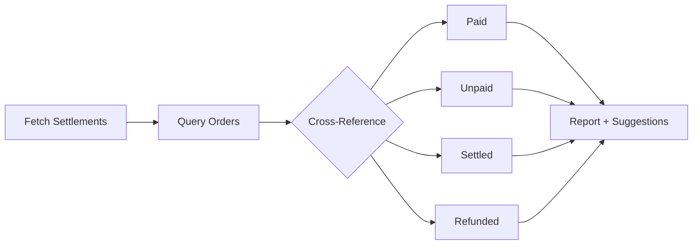
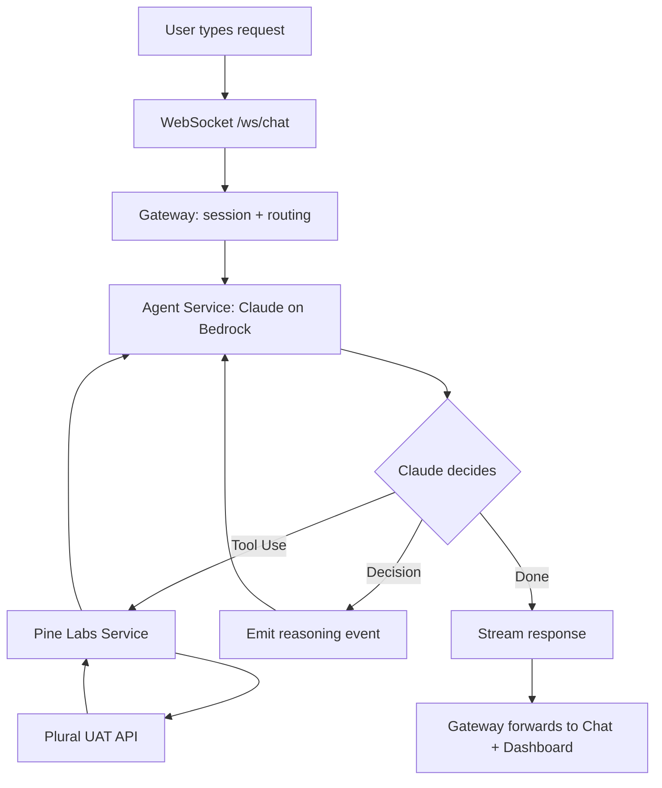
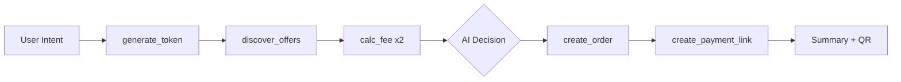
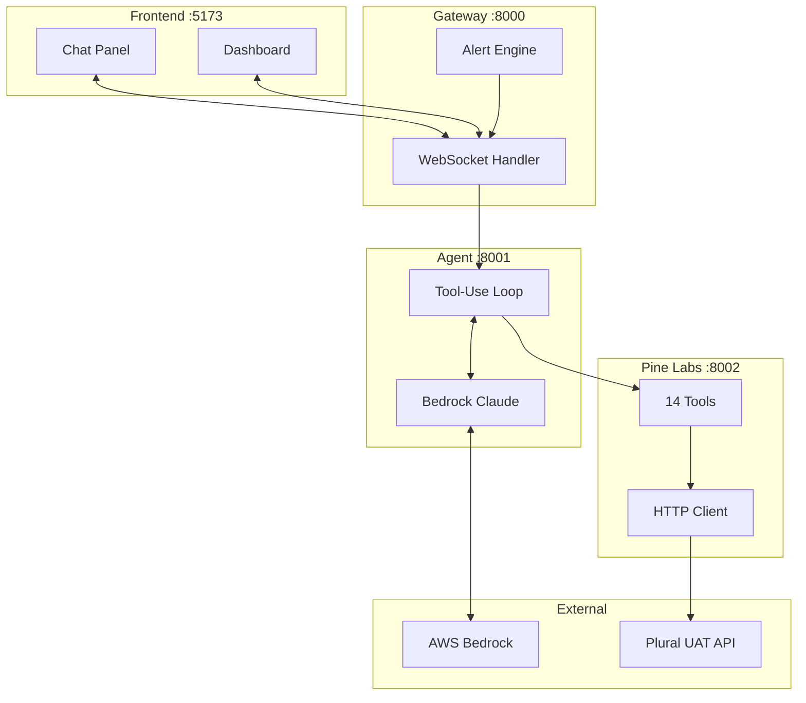
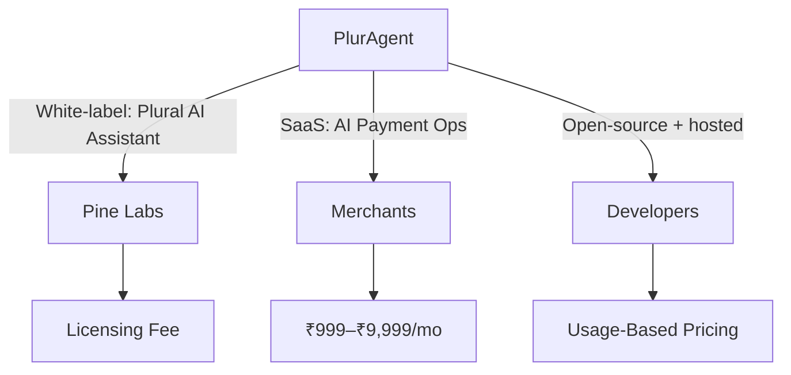
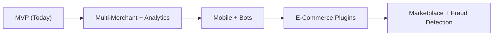

# PlurAgent

### Agentic Commerce & Intelligent Payments Platform

> *"From natural language to payment in seconds — AI that thinks, decides, and acts."*

**Pine Labs AI Hackathon 2026** | **Devanshu Dangi**

---

## The Problem

### Payment integration is broken.

- Merchants juggle **10+ APIs** manually for every transaction
- Each checkout flow requires **5–7 sequential API calls**
- Payment failures **cascade silently** — no retry, no fallback
- Every decision is **hardcoded** — no intelligence
- Reconciliation is a **manual spreadsheet exercise**

---

## Who Is Affected?

| Stakeholder | Pain Point |
|---|---|
| **Merchants** | Weeks of integration, manual failure monitoring |
| **Developers** | Hundreds of lines of boilerplate per checkout |
| **Payment Teams** | No real-time visibility, discover failures hours later |
| **Customers** | Abandoned checkouts when one method fails |

---

## Current Solutions Fall Short

| Approach | Limitation |
|---|---|
| Manual API Integration | Months of work, no intelligence |
| Payment Dashboards | Passive, no AI, no proactive alerts |
| Rule-Based Chatbots | Handle FAQs only, can't execute transactions |
| Gateway SDKs | No orchestration, no retry, no autonomy |

### The Gap

No solution combines **natural language + autonomous orchestration + intelligent decisions + real-time transparency**.

---

## Our Solution: PlurAgent

An **AI agent** (Claude on AWS Bedrock) that autonomously orchestrates **14 Pine Labs Plural APIs** through natural language.

```
Traditional:                    PlurAgent:

Write auth code                 "Buy a phone for ₹45,000,
Write order code                 find the best payment method"
Write offer lookup                        ↓
Write fee comparison             AI handles everything:
Write payment code               Auth → Offers → Fees → Order
Write error handling             → Decision → Payment → Summary
Write retry logic               
                                 = One sentence, 10 seconds
= Weeks of work                
```

---

## Key Capabilities

- **Conversational Interface** — Chat naturally to perform any payment operation
- **Autonomous Pipelines** — Agent chains multiple API calls without intervention
- **Intelligent Decisions** — Compares methods, recommends cheapest, explains why
- **Smart Retries** — Automatic fallback when payments fail
- **Real-Time Dashboard** — Watch every tool call and decision live
- **Proactive Alerts** — Notified about failures before you ask
- **QR Codes** — Payment links rendered as scannable QR in chat

---

## Innovation Pillar 1

### Agentic Checkout Orchestration

One sentence triggers a **full autonomous 7-step pipeline**:

| Step | Action | Tool |
|---:|---|---|
| 1 | Authenticate | `generate_token` |
| 2 | Discover offers | `discover_offers` |
| 3 | Compare fees | `calculate_convenience_fee` |
| 4 | Create order | `create_order` |
| 5 | Make decision | *AI Decision Engine* |
| 6 | Generate payment link | `create_payment_link` |
| 7 | Deliver summary + QR | *Response* |

---

## Innovation Pillar 2

### Intelligent Decisioning Engine

Before any payment, the agent:

1. Discovers all available offers (EMI, cashback, BNPL)
2. Calculates convenience fees for multiple methods
3. **Recommends the best option with reasoning**

> *"I recommend UPI: zero convenience fee (saving ₹150) plus ₹200 cashback. Total savings: ₹350."*

Decisions are displayed in an **expandable Decision Panel** in chat.

---

## Innovation Pillar 3

### Smart Retry Engine

Payment fails? The agent doesn't give up.


At each switch, the agent **explains why**:

> *"Card declined — insufficient funds. Switching to UPI: zero fees, instant processing."*

---

## Innovation Pillar 4

### Proactive Alert Engine

Background monitoring pushes alerts **before the merchant asks**:

| Alert | Trigger |
|---|---|
| **Multiple Failures** | 3+ API failures in succession |
| **Unpaid Orders** | Orders with no payment received |

Alerts appear with severity levels: `info` | `warning` | `danger`

---

## Innovation Pillar 5

### Smart Reconciliation



> 25/31 paid. 6 links pending. 2 refunds.
> **Mismatch:** Order a08 — B2B pending (₹85,000)

---

## Innovation Pillar 6

### Real-Time Decision Transparency

Every action streamed live to the dashboard:

- **Activity Timeline** — Tool calls over time
- **Stats Cards** — Orders, payments, refunds, total amount
- **Transaction Feed** — Live order/payment/refund details
- **Workflow Progress** — Step-by-step pipeline visualization
- **Decision Audit Trail** — Full reasoning for every choice

Nothing happens in a black box.

---

## How It Works — Data Flow



---

## Agentic Checkout Flow



One sentence triggers all 7 steps autonomously.

---

## Technical Architecture



---

## Why Microservices?

| Service | Port | Role |
|---|---|---|
| **Frontend** (React + Vite) | 5173 | Chat UI + Dashboard |
| **Gateway** (FastAPI) | 8000 | Routing, sessions, alerts |
| **Agent** (FastAPI) | 8001 | Bedrock Claude, tool-use loop |
| **Pine Labs** (FastAPI) | 8002 | 14 tool implementations |

- Swap LLM providers without touching payment logic
- Isolate credential management
- Scale services independently

---

## Tech Stack

| Layer | Technology |
|---|---|
| **Frontend** | React 19, TypeScript 5.9, Vite 8, Tailwind CSS 4, Recharts |
| **Backend** | Python 3.11+, FastAPI, Uvicorn, httpx |
| **AI** | AWS Bedrock — Claude 3.5 Sonnet |
| **Payments** | Pine Labs Plural API v1 (14 tools, UAT sandbox) |
| **Real-Time** | Native WebSocket (chat + dashboard) |
| **Extras** | qrcode.react, Lucide React, Web Speech API |

---

## 14 Pine Labs API Tools

All integrated as autonomous agent capabilities:

| Category | Tools |
|---|---|
| **Auth** | `generate_token` |
| **Customer** | `create_customer` |
| **Orders** | `create_order`, `get_order_status` |
| **Payments** | `create_payment`, `discover_offers`, `calculate_convenience_fee` |
| **Refunds** | `create_refund`, `get_settlements` |
| **Links** | `create_payment_link`, `manage_subscription` |
| **International** | `currency_conversion` |
| **Analytics** | `reconcile_transactions`, `analyze_activity` |

---

## Demo: Smart Shopping Agent

**User:** *"Buy a phone for ₹45,000, find the best EMI options"*

**Agent:**
1. Authenticates with Pine Labs
2. Finds: ₹5,000 off Credit Card EMI, 10% ICICI discount
3. Compares: CARD fee ₹900 vs UPI fee ₹0
4. Creates order → Recommends UPI with reasoning
5. Generates payment link + QR code

**Result:** Full checkout in ~10 seconds from a single sentence.

---

## Demo: Smart Retry

**User:** *"Pay ₹8,500 for order e05"*

**Agent:**
1. CARD → **Declined** (3DS verification failed)
2. NETBANKING → **Failed** (session expired)
3. UPI → **Success**

> *"Card failed due to 3DS decline. Netbanking session expired. Switched to UPI — payment of ₹8,500 processed successfully."*

All 3 attempts visible in real-time on dashboard.

---

## Demo: Reconciliation

**User:** *"Reconcile today's transactions"*

**Agent reports:**
- 25/31 orders paid (80.6%)
- 20 settled, 5 awaiting settlement
- 6 payment links still pending
- 2 refunds processed

**Mismatches flagged:**
- Order a08: B2B invoice pending (₹85,000)
- Order m03: Payment link sent, awaiting completion

---

## Impact & Benefits

### For Pine Labs
- Higher API adoption (all 14 APIs used naturally)
- AI-native showcase for the Plural platform
- Premium product tier opportunity

### For Merchants
- **80% less integration time** — one sentence replaces weeks of work
- Zero manual monitoring — proactive alerts
- Higher payment success rates — smart retry engine

### For Developers
- Natural language interface over complex APIs
- Transparent debugging via real-time dashboard

---

## How to Sell

### Platform Play — Three Target Audiences



### Revenue Model
| Model | Target | Pricing |
|---|---|---|
| Licensing | Pine Labs | Annual + per-transaction |
| SaaS | Merchants | ₹999–₹9,999/mo |
| Usage-Based | Developers | Pay per API call |

---

## Future Scope

### Near-Term (3–6 months)
- Multi-merchant support with role-based access
- Persistent conversation history (database-backed)
- Predictive failure forecasting

### Medium-Term (6–12 months)
- Mobile SDK (React Native / Flutter)
- WhatsApp / Telegram bot integration
- Shopify, WooCommerce, Magento plugins
- Multi-LLM support (GPT-4, Gemini, Llama)

### Long-Term (12+ months)
- AI-powered fraud detection
- Multi-language support (Hindi, regional)
- Autonomous daily operations (auto-reconcile, auto-report)
- Third-party developer marketplace



---

## Key Takeaway

> **PlurAgent turns 14 APIs and hundreds of lines of integration code into a single sentence.**

### Built With
- Pine Labs Plural API (14 tools)
- AWS Bedrock (Claude 3.5 Sonnet)
- React + FastAPI + WebSocket

### Key Numbers
- **14** Pine Labs APIs as agent tools
- **6** innovation pillars
- **3** microservices
- **1** sentence to complete a full payment workflow

---

# Thank You

### PlurAgent — Agentic Commerce & Intelligent Payments Platform

**Devanshu Dangi** | **Pine Labs AI Hackathon 2026**

*Questions?*
